## On Crée un dossier `tests/` à la racine du projet

## On crée un fichier `CalculatorTest.php` dans `tests/`

On test l'addition
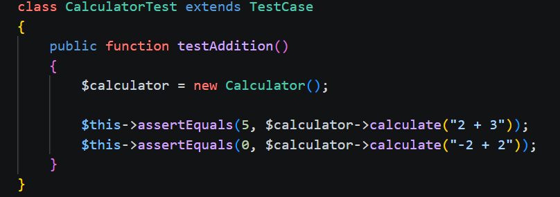
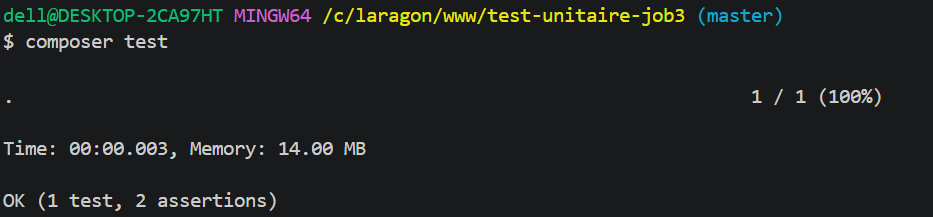

On test la soustraction
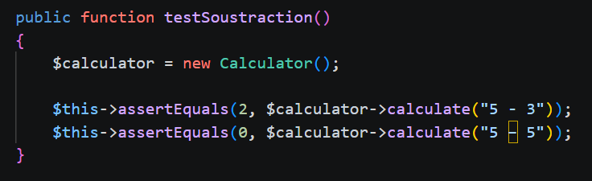
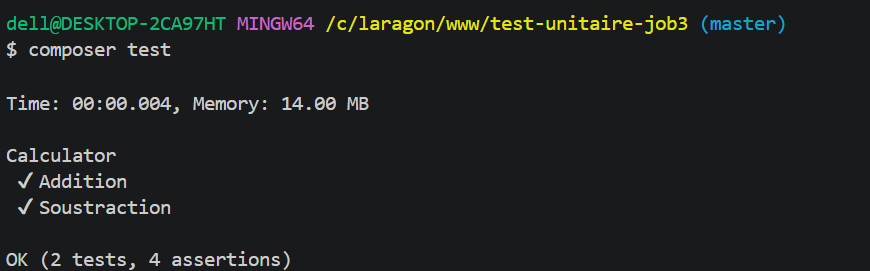

On test la multiplication
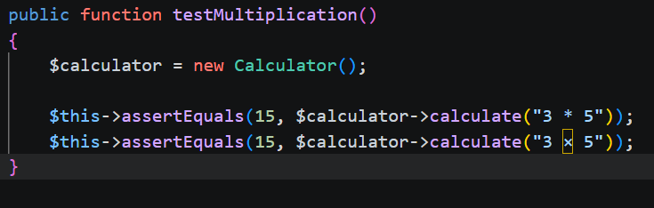
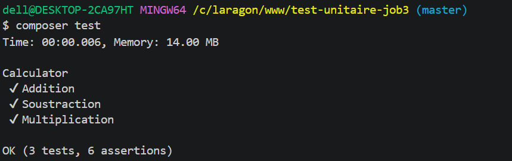

On test la division
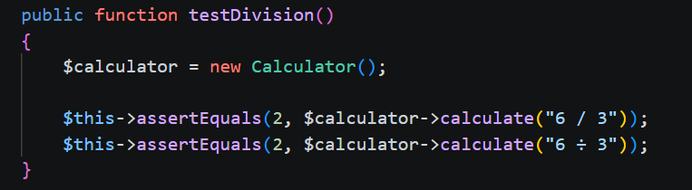
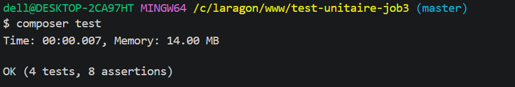

## On crée un fichier `calculator.test.js` dans `tests/`

On test l'addition
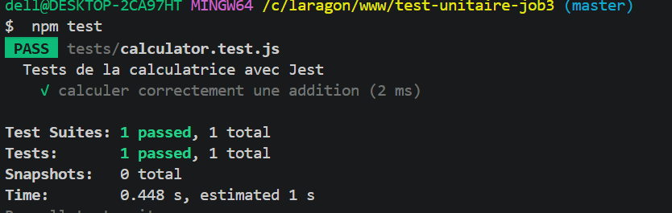

On test la soustraction
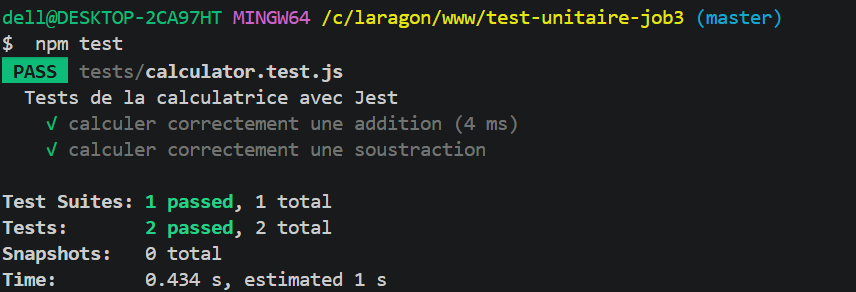

On test la multiplication
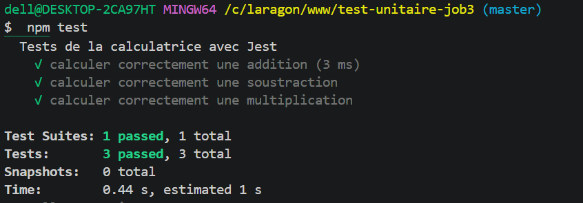

On test la division
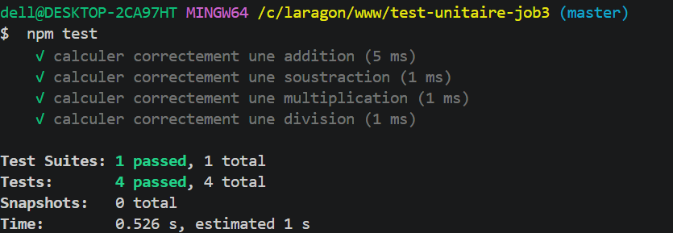

On test les priorités des opérateurs
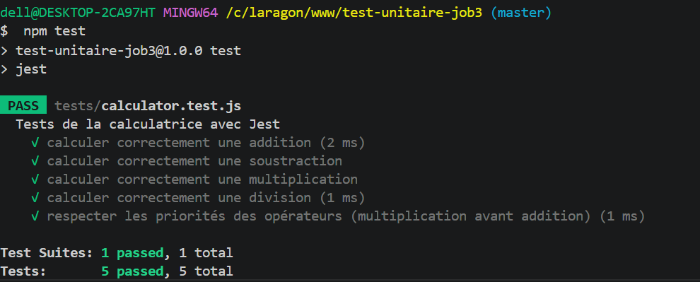

On test Les parenthèses ((2+3)\*4)
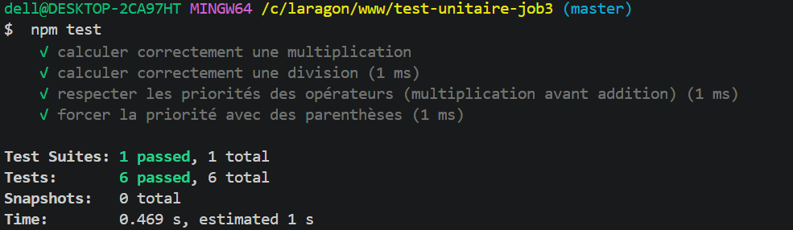

On test le comportement en cas d'expression invalide (2+bad)
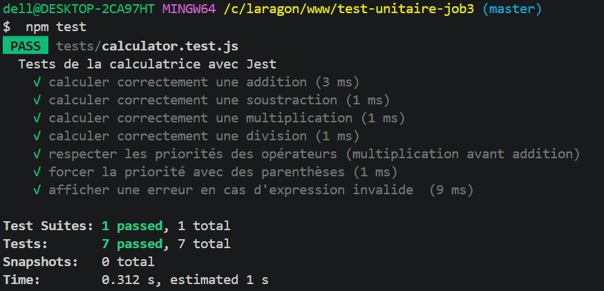

## Bonus

On test le cas d'une chaine vide calculatrice php

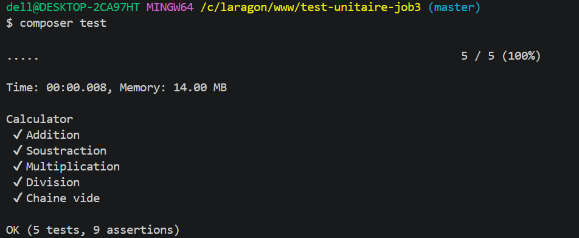
